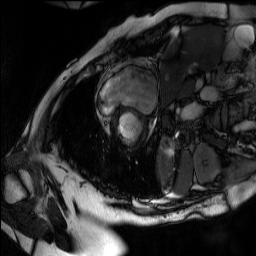

# Learning-Active-Contour
MVA Deformable Models project, based on [this article](https://openaccess.thecvf.com/content_CVPR_2019/papers/Chen_Learning_Active_Contour_Models_for_Medical_Image_Segmentation_CVPR_2019_paper.pdf). Heart segmentation using UNet and a custom Active Contour loss.

|  |   |  |
|:--:| :--:| :--:| 
| MRI image | Ground Truth Segmentation | Our prediction |
